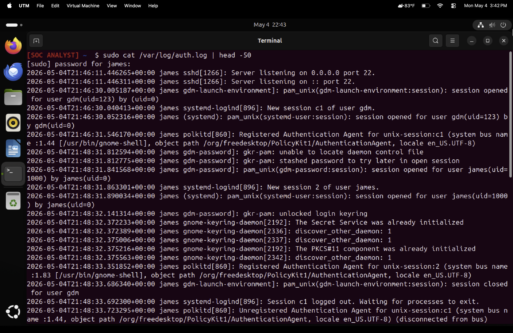
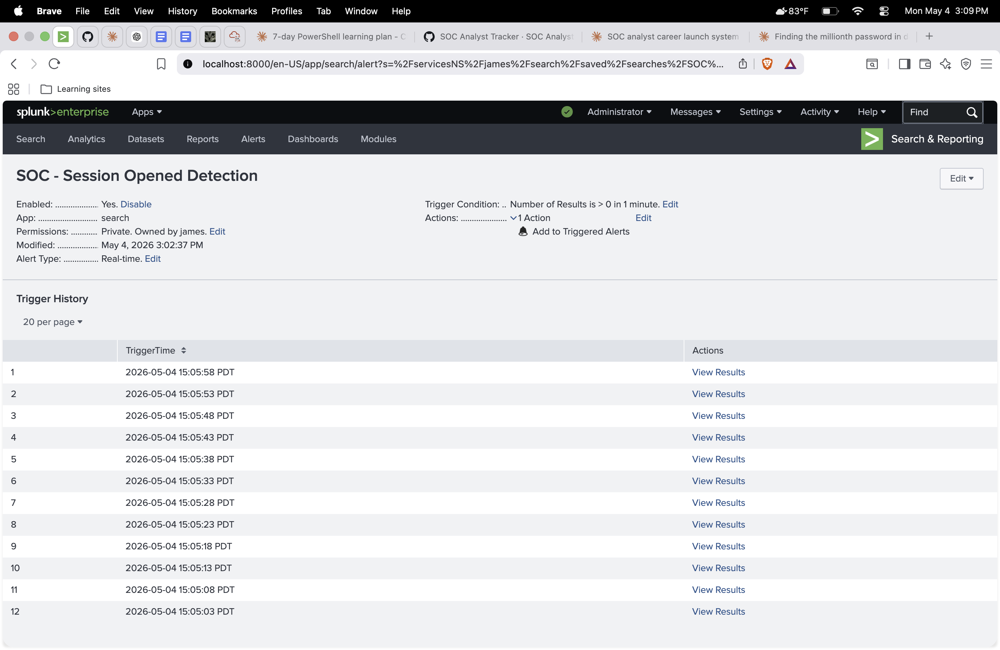
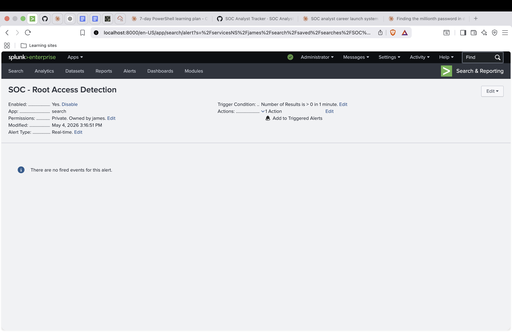
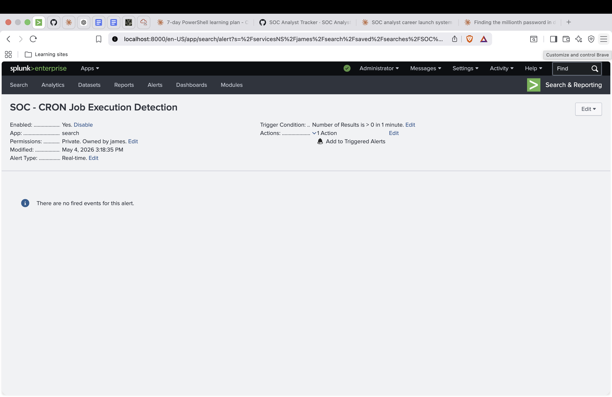
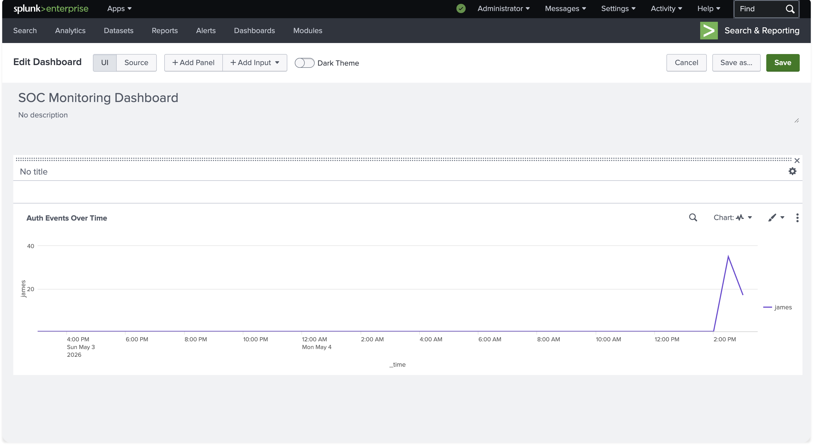
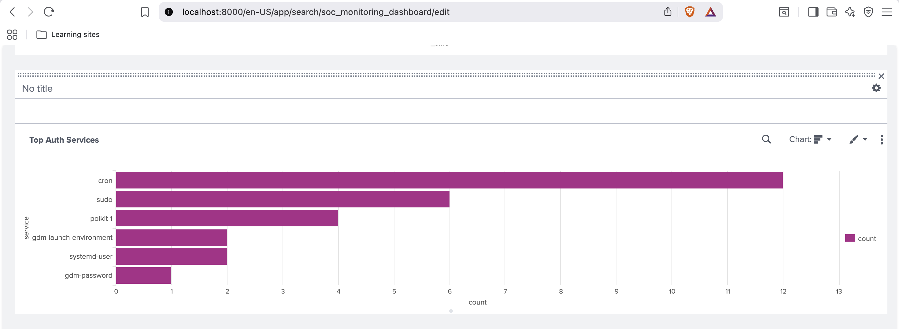
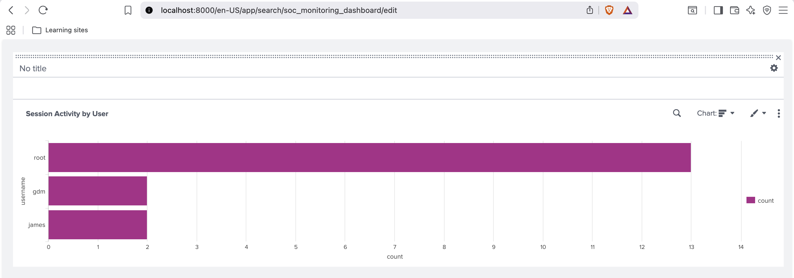
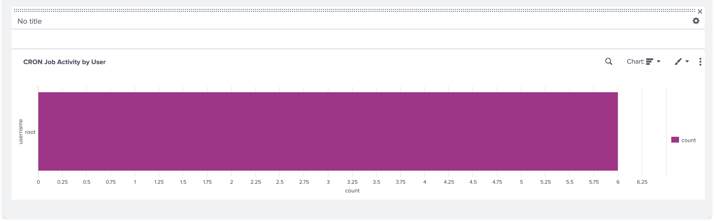
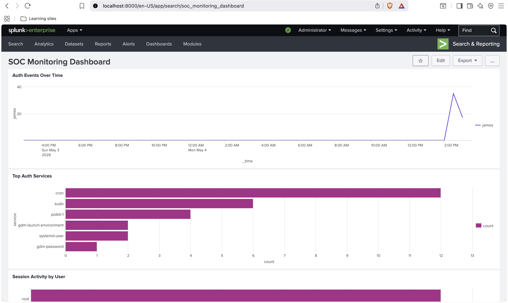
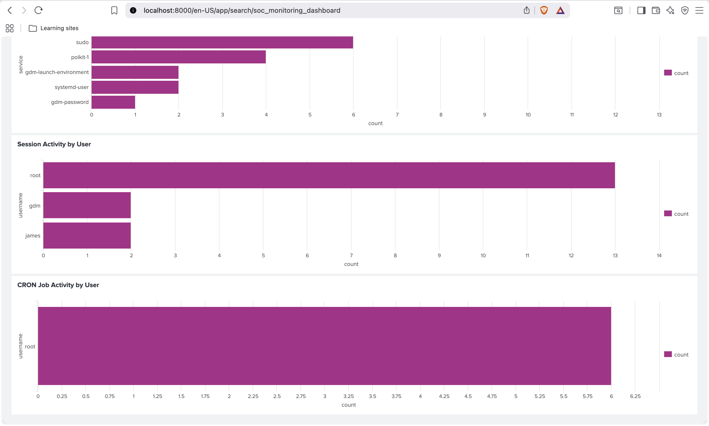

# Day 08 – SOC Tier 1 Incident Report: Splunk SIEM Alert Rules & Dashboard

---

## Incident Summary

- **Incident Type:** SIEM Detection Engineering & Authentication Monitoring
- **Severity:** Medium (Production-Grade Detection Build)
- **Detection Method:** Splunk SPL Real-Time Alerts + Live Dashboard Correlation
- **Tools Used:** Splunk Enterprise, Splunk Universal Forwarder, SPL, Ubuntu Linux, `/var/log/auth.log`
- **Status:** Operational 4 Alerts Active, 4-Panel Dashboard Deployed (Simulated SOC Environment)

---

## Executive Summary

This investigation focuses on building a production-grade SIEM detection capability using real authentication telemetry from an Ubuntu endpoint. Logs were forwarded into Splunk Enterprise via the Universal Forwarder, and four real-time SPL detection rules were authored to monitor authentication, privilege escalation, root access, and scheduled task execution.

A four-panel SOC monitoring dashboard was built on top of the live data feed to provide operational visibility, surface anomalous patterns, and support Tier 1 triage workflows.

---

## Affected System

- **SIEM Platform:** Splunk Enterprise (Trial) — `localhost:8000`
- **Forwarder:** Splunk Universal Forwarder v10.2.2
- **Log Source Endpoint:** Ubuntu Linux VM
- **Connected Endpoints:** Windows 11, Kali Linux, Ubuntu
- **Log Sources:**
  - `/var/log/auth.log` (live authentication telemetry)
  - Splunk index: `main`
  - Sourcetype: `linux_secure`

---

## Investigation Methodology

---

### 1. Log Source Configuration & Ingestion Verification



- Configured Splunk Universal Forwarder on Ubuntu via `inputs.conf`
- Enabled real-time monitoring of `/var/log/auth.log`
- Verified live ingestion using base SPL search

```
[monitor:///var/log/auth.log]
disabled = false
index = main
sourcetype = syslog
```

```spl
index=main source="/var/log/auth.log"
```

### SOC Observations:

- Live session open/close events confirmed in Splunk Search
- `sudo` privilege escalation events visible in real time
- CRON job execution events streaming continuously
- `gdm` desktop login events captured and indexed

---

## Detection Engineering — Alert Rules

---

### 2. Alert 1 — Session Opened Detection



```spl
index=main source="/var/log/auth.log" "session opened"
```

- **Alert Type:** Real-time
- **Trigger:** Number of results > 0
- **Purpose:** Detect any new authenticated session opened on the endpoint
- **SOC Use Case:** Login monitoring and access auditing

### SOC Observations:

- Session-open events are the foundational signal for access monitoring
- Useful for correlating user activity timelines
- Forms the baseline data layer for anomaly detection

---

### 3. Alert 2 — Sudo Privilege Escalation


```spl
index=main source="/var/log/auth.log" "sudo"
```

- **Alert Type:** Real-time
- **Trigger:** Number of results > 0
- **Purpose:** Detect privilege escalation via `sudo`
- **SOC Use Case:** Insider threat and lateral movement detection

### SOC Observations:

- `sudo` events indicate elevation of privilege beyond standard user scope
- Critical signal for identifying unauthorized administrative actions
- Common precursor to system tampering or persistence setup

---

### 4. Alert 3 — Root Access Detection



```spl
index=main source="/var/log/auth.log" "user root"
```

- **Alert Type:** Real-time
- **Trigger:** Number of results > 0
- **Purpose:** Detect any direct root account activity
- **SOC Use Case:** Critical-severity monitoring — root access is always investigated

### SOC Observations:

- Direct root access is a high-priority security signal
- Should be cross-referenced against authorized administrator activity
- Frequent root access from non-administrative users indicates compromise

---

### 5. Alert 4 — CRON Job Execution Detection



```spl
index=main source="/var/log/auth.log" "CRON"
```

- **Alert Type:** Real-time
- **Trigger:** Number of results > 0
- **Purpose:** Detect scheduled job execution
- **SOC Use Case:** Persistence mechanism detection

### SOC Observations:

- CRON is one of the most abused persistence mechanisms on Linux
- Unexpected CRON jobs often indicate attacker-installed scheduled tasks
- Baseline of expected CRON activity must be established for anomaly detection

---

## SOC Monitoring Dashboard

---

### 6. Panel 1 — Authentication Events Over Time



```spl
index=main source="/var/log/auth.log"
| timechart count by host
```

- Line chart visualizing authentication activity across a 24-hour window
- Surfaces volume spikes indicative of brute force or anomalous access patterns
- Per-host breakdown for multi-endpoint correlation

### SOC Observations:

- Time-series visibility is essential for spotting authentication anomalies
- Sudden volume spikes warrant immediate Tier 1 triage
- Forms the primary "at-a-glance" SOC view

---

### 7. Panel 2 — Top Authentication Services



```spl
index=main source="/var/log/auth.log"
| rex "pam_unix\((?<service>[^:]+)"
| stats count by service
| sort -count
```

- Bar chart showing services generating the most authentication events
- **Results:** `cron` (12), `sudo` (6), `polkit-1` (4)
- Identifies which authentication subsystems are most active

### SOC Observations:

- CRON dominance is consistent with system-level scheduled activity
- Sudo activity reflects authorized user privilege elevation
- Polkit events correlate with desktop authorization prompts

---

### 8. Panel 3 — Session Activity by User



```spl
index=main source="/var/log/auth.log" "session opened"
| rex "for user (?<username>\S+)\("
| stats count by username
| sort -count
```

- Bar chart showing session counts per user
- **Results:** `root` (13), `gdm` (2), `james` (2)
- Surfaces top session initiators across the endpoint

### SOC Observations:

- Root session dominance is consistent with CRON/system activity
- Per-user session tracking enables behavioural baselining
- Anomalous user accounts surface immediately in this view

---

### 9. Panel 4 — CRON Job Activity by User



```spl
index=main source="/var/log/auth.log" "CRON"
| rex "for user (?<username>\S+)\("
| stats count by username
| sort -count
```

- Bar chart showing which users are executing scheduled CRON jobs
- Root account observed as the dominant CRON executor flagged for review
- Supports persistence detection and scheduled task auditing

### SOC Observations:

- Root-only CRON activity is expected for system maintenance jobs
- Unexpected user accounts running CRON jobs is a persistence indicator
- This panel directly supports MITRE T1053.003 detection

---

## Final Dashboard Deployment

---

### 10. SOC Dashboard - Operational View



- Consolidated 4-panel SOC monitoring dashboard rendered in Splunk
- All panels driven by live Ubuntu authentication telemetry
- Real-time refresh enabled for continuous Tier 1 visibility

### SOC Observations:

- Unified dashboard view supports rapid triage decision-making
- All panels correlate to active alert rules for end-to-end coverage
- Production-grade SOC visibility achieved using real data

---

### 11. SOC Dashboard — Extended View



- Extended dashboard view showing detailed panel layout
- Confirms operational status of all 4 detection panels
- Validates dashboard readiness for SOC handoff

### SOC Observations:

- Dashboard is production-ready and recruiter-demonstrable
- All visualizations support Tier 1 analyst workflows
- End-to-end detection pipeline validated from forwarder to UI

---

## Indicators of Compromise (IOCs) / Behavioural Patterns

| Type | Pattern | Source |
|------|---------|--------|
| Persistence Indicator | Continuous CRON execution as `root` | Panel 4 |
| Privilege Escalation | `sudo` invocations by user `james` | Alert 2 |
| Root Activity | 13 root sessions observed | Panel 3 |
| Authentication Volume | CRON-dominant event distribution | Panel 2 |
| Service Activity | `pam_unix` activity across cron, sudo, polkit-1 | Panel 2 |

---

## MITRE ATT&CK Mapping

| Behavior                       | Technique ID | Detection Coverage |
|--------------------------------|--------------|--------------------|
| Sudo and Sudo Caching          | T1548.003    | Alert 2            |
| Scheduled Task/Job: Cron       | T1053.003    | Alert 4 / Panel 4  |
| Valid Accounts                 | T1078        | Alert 1            |
| Valid Accounts: Local Accounts | T1078.003    | Alert 3            |

---

## SOC Analyst Findings

- Live Ubuntu authentication telemetry successfully ingested into Splunk
- Four real-time detection rules deployed and validated against live events
- CRON job execution running exclusively as root consistent with system activity
- Sudo privilege escalation events captured and correlated with lab user `james`
- 13 root sessions observed across the monitoring window driven by scheduled jobs
- No unauthorized access or anomalous login patterns detected
- End-to-end detection pipeline validated from log source to dashboard

---

## SOC Analyst Response

- Maintain Universal Forwarder telemetry pipeline for continuous visibility
- Establish baseline thresholds for CRON, sudo, and root activity volumes
- Convert real-time alerts into scheduled correlation searches for production scaling
- Implement alert suppression rules to reduce false-positive volume from expected CRON activity
- Build user-behavior analytics on top of session and sudo telemetry
- Cross-reference root activity against authorized administrator accounts
- Escalate any unexpected CRON entries from non-root users to Tier 2

---

## Analyst Insight

Effective detection engineering does not require simulated data. By connecting a live Ubuntu endpoint to Splunk via the Universal Forwarder, this lab produced production-grade alert rules and dashboards driven by authentic authentication telemetry. The CRON-running-as-root pattern surfaced immediately and is a recurring persistence signal in real environments analysts who recognize and baseline this behaviour are positioned to detect the abnormal variants that indicate active compromise.

---

## Learning Outcome

This investigation demonstrates the ability to:

- Configure Splunk Universal Forwarder for real-time Linux log streaming
- Author SPL detection queries targeting authentication and privilege events
- Build real-time alert rules in Splunk Enterprise
- Construct multi-panel SOC monitoring dashboards from live telemetry
- Apply `rex` field extractions for SPL-driven analytics
- Identify CRON-based persistence using MITRE ATT&CK methodology
- Map detection rules to the MITRE ATT&CK framework
- Operate a Tier 1 SOC dashboard for triage and correlation
- Validate end-to-end SIEM pipelines from log source to visualization

---

## Repository Structure

```
splunk-siem-alert-rules-dashboard/
├── README.md
├── spl-queries/
│   ├── alert1_session_opened.spl
│   ├── alert2_sudo_escalation.spl
│   ├── alert3_root_access.spl
│   └── alert4_cron_detection.spl
└── screenshots/
    ├── splunk_auth_logs.png
    ├── alert1_session_opened.png
    ├── alert2_sudo_escalation.png
    ├── alert3_root_access.png
    ├── alert4_cron_detection.png
    ├── dashboard_panel1.png
    ├── dashboard_panel2.png
    ├── dashboard_panel3.png
    ├── dashboard_panel4.png
    ├── soc_dashboard_final_1.png
    └── soc_dashboard_final_2.png
```

---

## Conclusion

This investigation delivers a fully operational Splunk detection engineering build powered by live endpoint telemetry. Four real-time alert rules monitor authentication patterns on a production Ubuntu endpoint, and a four-panel SOC dashboard provides immediate operational visibility. The end-to-end pipeline from forwarder configuration to dashboard rendering demonstrates production-grade detection capability and Tier 1 SOC readiness.
