# Splunk Alert Engineering and SOC Dashboard

I built four real time monitoring alerts and a four panel Splunk dashboard using live authentication telemetry from an Ubuntu endpoint, then used the resulting activity to establish a behavioural baseline and identify where the rules would need tuning.

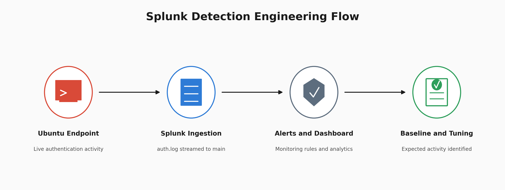

The project follows the telemetry from the Ubuntu endpoint into Splunk, through monitoring rules and dashboard analytics, and finally into baseline analysis and tuning decisions.

## At a Glance

| Field | Detail |
| --- | --- |
| Build Type | SIEM detection engineering and monitoring |
| Platform | Splunk Enterprise, Splunk Universal Forwarder v10.2.2 |
| Log Source | `/var/log/auth.log`, live Ubuntu endpoint |
| Index and Sourcetype | `main`, `syslog` |
| Delivered | 4 real time alerts, 4 panel dashboard |
| Outcome | Pipeline validated end to end, baseline established, no obvious anomalous pattern identified in the dashboard evidence reviewed |

## What Happened

An Ubuntu endpoint was connected to Splunk through the Universal Forwarder, streaming real authentication logs.

I verified ingestion before building the monitoring logic. I then created four broad SPL alerts and four dashboard panels to examine session activity, sudo activity, root activity, CRON execution, authentication services, and user behaviour.

The purpose was not to manufacture an attack.

The purpose was to understand what normal authentication activity looked like on this host before deciding what should be considered abnormal.

## Log Source Configuration

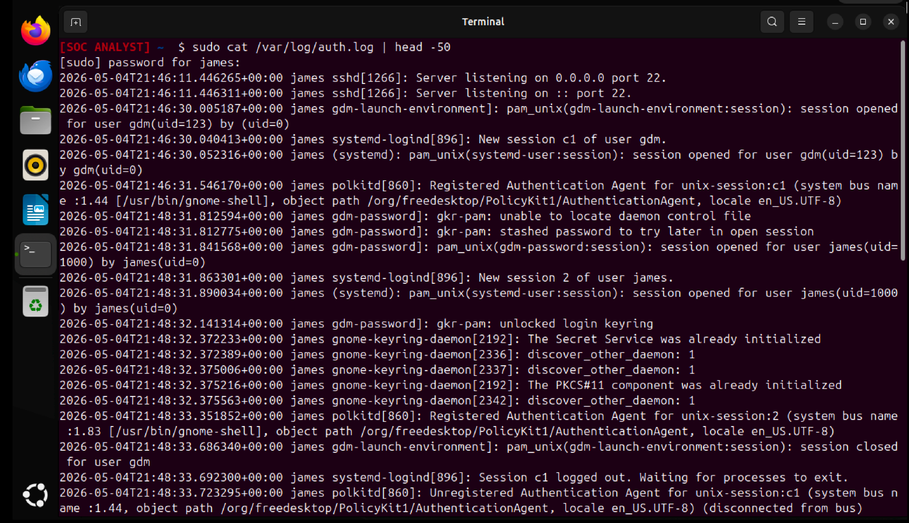

The Ubuntu host was configured to send `/var/log/auth.log` into Splunk.

```text
[monitor:///var/log/auth.log]
disabled = false
index = main
sourcetype = syslog
```

I verified ingestion before writing the monitoring searches.

```spl
index=main source="/var/log/auth.log"
```

The reviewed telemetry included session activity, sudo activity, CRON execution, and desktop authentication events.

This established that the data source was available before detection logic was built on top of it.

## Alert 1, Session Opened

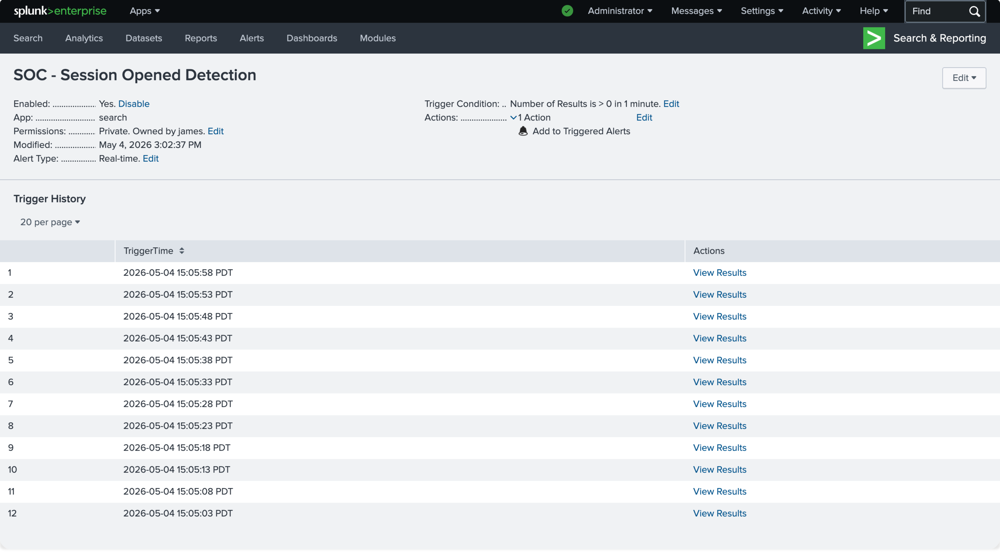

```spl
index=main source="/var/log/auth.log" "session opened"
```

The alert runs in real time and triggers when the search returns more than zero results.

It matches authentication log events containing `session opened`.

This provides visibility into PAM session activity that can later be correlated by user and service when building an activity timeline.

The query is intentionally broad. A session opening is not automatically suspicious.

## Alert 2, Sudo Privilege Escalation

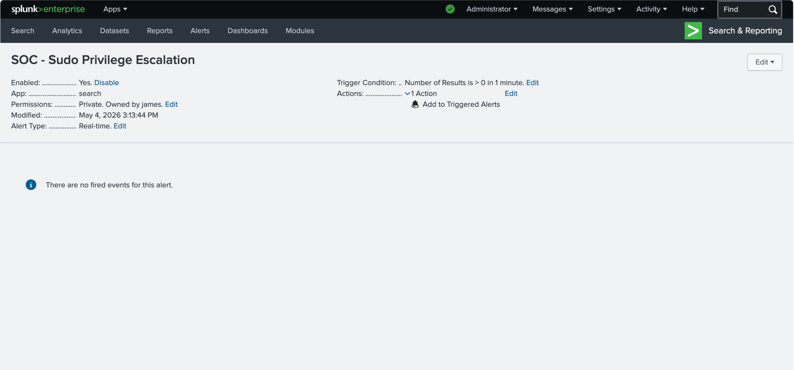

```spl
index=main source="/var/log/auth.log" "sudo"
```

The alert runs in real time and triggers when the search returns more than zero results.

It monitors sudo related authentication activity that may require investigation when reviewing privileged actions.

Sudo activity is common on a Linux system, so the presence of a sudo event alone does not establish malicious privilege escalation.

The user, timing, command, and surrounding activity provide the context needed to determine whether the action is expected.

## Alert 3, Root Account Activity

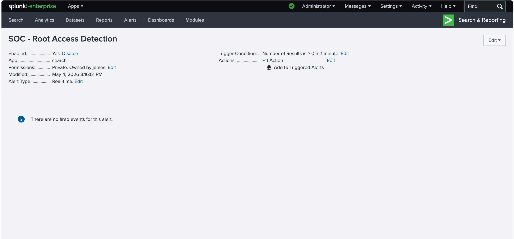

```spl
index=main source="/var/log/auth.log" "user root"
```

The alert runs in real time and triggers when the search returns more than zero results.

It monitors authentication events referencing the root account.

The query does not distinguish an interactive root login from scheduled activity attributed to root.

Service and session context must therefore be examined before deciding whether the activity is expected or requires investigation.

This distinction became important later when the dashboard showed a high number of root sessions.

## Alert 4, CRON Job Execution

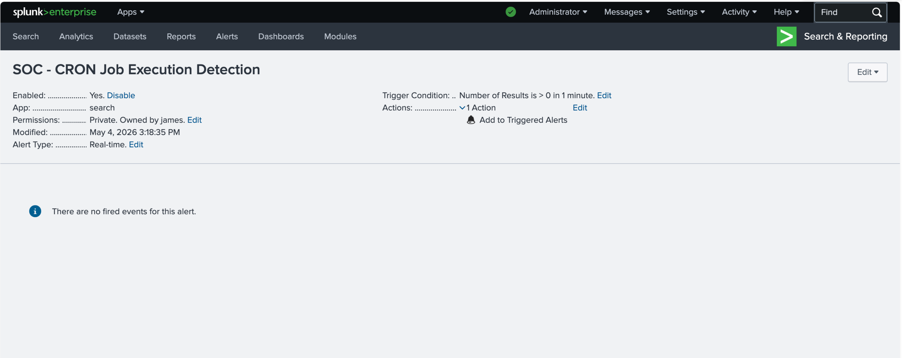

```spl
index=main source="/var/log/auth.log" "CRON"
```

The alert runs in real time and triggers when the search returns more than zero results.

It monitors CRON related authentication activity.

CRON can be relevant during persistence investigations, but a CRON event does not establish persistence by itself.

Unexpected users, timing, jobs, or changes would require additional investigation against the host baseline.

## Alert Trigger History

I checked the trigger history of the four alerts rather than assuming that a working search meant every alert had fired.

Alert 1, Session Opened, showed multiple fires in its Splunk trigger history.

Alerts 2, 3, and 4 showed no fired events in the reviewed screenshots.

The underlying activity monitored by those searches was visible elsewhere in the telemetry. Sudo and CRON activity, for example, appeared in the dashboard and raw log review.

That means there is an important distinction between the search logic matching existing data and the configured alert actually recording a new trigger after it was enabled.

A working search is not automatically evidence that an alert has fired.

## Dashboard Panel 1, Authentication Events Over Time

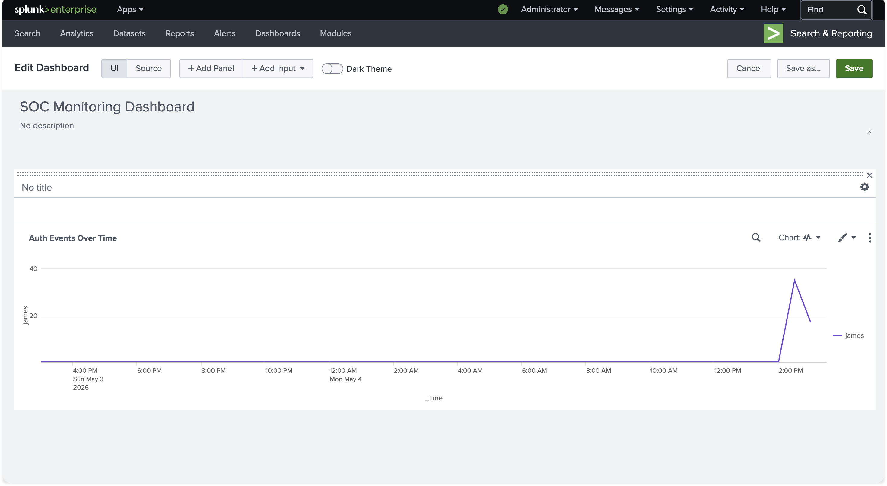

```spl
index=main source="/var/log/auth.log"
| timechart count by host
```

This panel shows authentication event volume over time.

A sudden change in volume can provide an investigation lead.

However, volume alone does not establish brute force activity. A spike would need to be correlated with the underlying authentication events, accounts, sources, and timing before reaching that conclusion.

## Dashboard Panel 2, Top Authentication Services

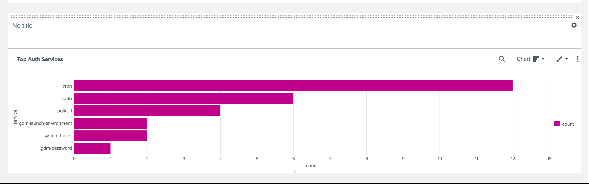

```spl
index=main source="/var/log/auth.log"
| rex "pam_unix\((?<service>[^:]+)"
| stats count by service
| sort -count
```

This panel extracts the PAM service from the raw log text and turns it into a countable field.

Observed activity included:

```text
cron       12
sudo        6
polkit-1    4
```

CRON generated the largest count in the reviewed evidence.

Sudo activity was also present, while `polkit-1` appeared in desktop authorisation activity.

The panel provides service context that cannot be obtained from total authentication volume alone.

## Dashboard Panel 3, Session Activity by User

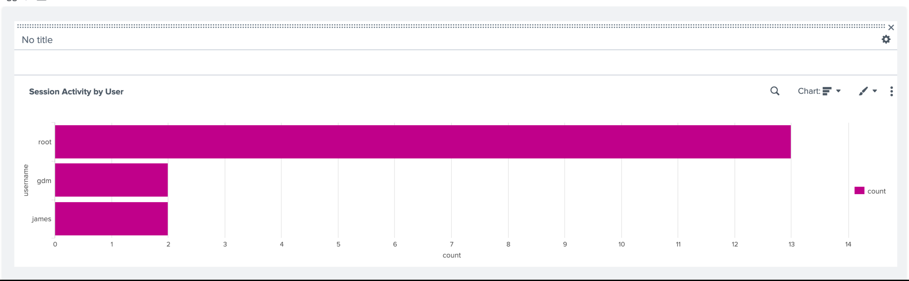

```spl
index=main source="/var/log/auth.log" "session opened"
| rex "for user (?<username>\S+)\("
| stats count by username
| sort -count
```

This panel groups session opening events by username.

Observed:

```text
root     13
gdm       2
james     2
```

The root account immediately stood out with 13 session events.

That number could look suspicious when viewed by itself.

The next panel provided the context needed to interpret it.

## Dashboard Panel 4, CRON Activity by User

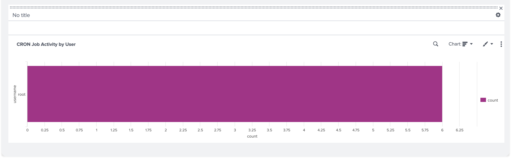

```spl
index=main source="/var/log/auth.log" "CRON"
| rex "for user (?<username>\S+)\("
| stats count by username
| sort -count
```

This panel identifies which users appear in the reviewed CRON activity.

Root was the dominant CRON user.

That provided context for the elevated root session count seen in Panel 3 and supported interpreting the observed activity as scheduled system behaviour rather than treating the count alone as an incident.

A new or unexpected user appearing in CRON activity would require investigation against the established host baseline and authorised scheduled jobs.

## Dashboard Deployment

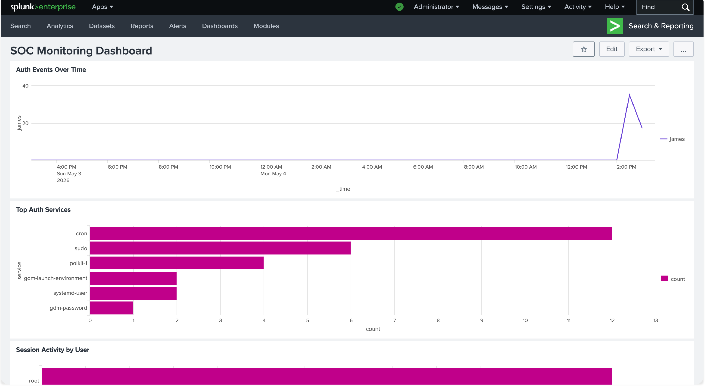

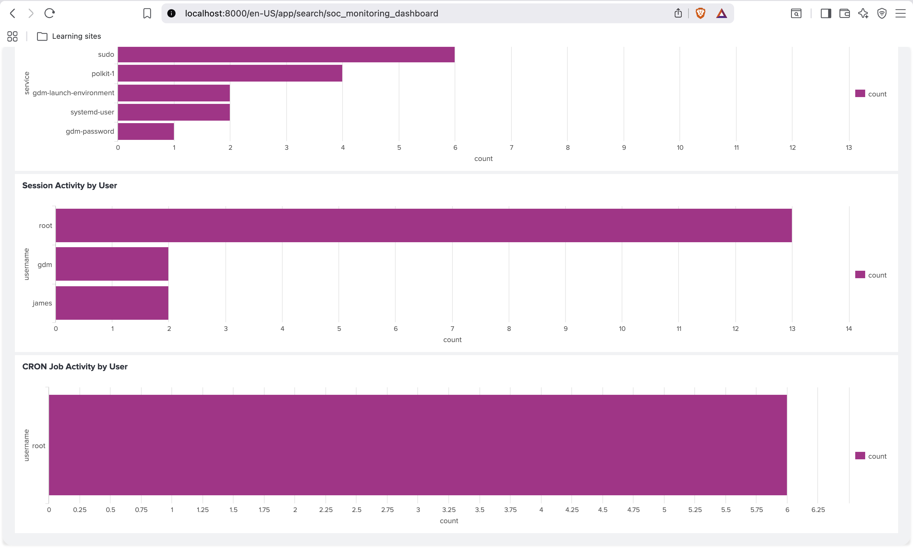

The four panels were consolidated into a single monitoring view using the same Ubuntu authentication telemetry.

The dashboard adds aggregation and field extraction to provide context around the activity monitored by the alerts.

The dashboard panels and alert searches are related through the same telemetry, but they are not all identical searches.

The documented pipeline is:

```text
Ubuntu authentication activity
        ↓
Universal Forwarder
        ↓
Splunk index
        ↓
SPL monitoring searches
        ↓
Dashboard analysis
        ↓
Baseline and tuning decisions
```

## Behavioural Baseline Observed

| Type | Pattern | Evidence |
| --- | --- | --- |
| Scheduled activity | CRON execution associated with root | Panel 4 |
| Privileged activity | Sudo events associated with user `james` | Alert and dashboard telemetry |
| Root sessions | 13 session events observed with CRON providing important context | Panels 3 and 4 |
| Service distribution | `pam_unix` activity across cron, sudo, and polkit-1 | Panel 2 |

These patterns form part of the observed baseline for this host.

They should not be treated as indicators of compromise simply because they match broad monitoring searches.

## MITRE ATT&CK Context

No adversary technique was confirmed in this project.

Two monitoring areas relate to ATT&CK behaviours that this telemetry could help investigate.

| Monitoring Area | ATT&CK Context |
| --- | --- |
| Sudo activity | T1548.003, Abuse Elevation Control Mechanism: Sudo and Sudo Caching |
| CRON activity | T1053.003, Scheduled Task or Job: Cron |

These mappings describe potential investigation context, not confirmed adversary activity or production detection coverage.

The current searches are broad string matches.

They would require additional filtering, thresholds, correlation, and validation before being treated as production detection logic.

Alert 1 and Alert 3 are intentionally not mapped to an ATT&CK technique because broad `session opened` and `user root` matches do not establish meaningful coverage for a specific adversary behaviour.

## Analyst Findings

Live Ubuntu authentication telemetry was successfully ingested and reviewed in Splunk.

Four real time monitoring alerts were configured against that telemetry.

Alert 1 had confirmed trigger history in the reviewed evidence.

Alerts 2, 3, and 4 had no recorded fires in their reviewed trigger history screenshots, even though activity relevant to some of their underlying searches appeared elsewhere in the telemetry.

The dashboard showed CRON, sudo, root, desktop, and user session activity.

The root session count initially stood out, but CRON activity provided important context for interpreting it as part of the observed baseline.

No obvious anomalous authentication pattern was identified in the dashboard evidence reviewed.

## Analyst Conclusion

This project established a working monitoring pipeline from an Ubuntu authentication log into Splunk searches, alerts, and dashboard analytics.

The most important result was not an attack detection.

It was establishing enough context to understand why activity that initially looked unusual could be expected on this host.

The project also showed that deploying an alert, confirming its search logic, and confirming that the alert itself has fired are three different things.

**Verdict:** Live authentication telemetry successfully monitored in Splunk, behavioural baseline established, and broad alert logic identified for further tuning.

## Honest Assessment of These Rules

The four alerts are intentionally broad.

They trigger whenever their searches return a match.

That is useful for learning how the telemetry behaves, but it would create unnecessary alert volume in a production environment.

For example, routine CRON execution should not continuously create analyst work simply because it contains the string `CRON`.

The observed baseline provides the information needed to begin replacing broad matches with more meaningful conditions.

## Lessons Learned

An alert that has been created is not the same as an alert that has been confirmed firing.

Three of the four alerts had no recorded fires in the reviewed trigger history screenshots, even though activity relevant to their searches appeared elsewhere in the telemetry.

Checking the trigger history directly prevented me from claiming more than the evidence supported.

The baseline analysis reinforced another lesson.

The 13 root session events looked important in isolation.

Only after comparing them with CRON activity did the number gain useful context.

A count needs context before it can be called normal or abnormal.

## What I Would Improve

I would let the alerts run longer so each rule could build a genuine trigger history before documenting its behaviour.

I would then convert the broad real time alerts into scheduled correlation searches with conditions based on the observed baseline.

Expected root CRON activity could be filtered or suppressed so that unusual activity becomes easier to identify.

I would also investigate new or unexpected CRON users against authorised scheduled jobs rather than assuming that every non root CRON event represents persistence.

Finally, I would commit the SPL searches as separate files in the repository so the detection logic can be reviewed independently of the README.

## Recommended Next Steps

Use the observed baseline to design more specific alert conditions.

Convert broad real time searches into scheduled correlation searches where appropriate.

Tune expected CRON and sudo activity to reduce unnecessary alert volume.

Correlate root activity with service, session type, and authorised administrator context.

Expand user behaviour baselining using the session and sudo telemetry.

Commit each SPL search as a separate repository artifact.

## What This Lab Demonstrates

This project demonstrates:

* Configuring Splunk ingestion for live Ubuntu authentication telemetry.
* Verifying telemetry before building monitoring logic.
* Writing SPL searches against raw Linux authentication events.
* Using `rex` to extract fields from unstructured log text.
* Creating real time monitoring alerts.
* Checking alert trigger history rather than assuming a search has fired.
* Building dashboard panels that answer specific investigation questions.
* Establishing a behavioural baseline from live system activity.
* Correlating root session activity with CRON context.
* Distinguishing broad monitoring logic from tuned detection logic.
* Scoping MITRE ATT&CK mappings to what the telemetry actually supports.

## Repository Structure

```text
.
├── README.md
└── screenshots/
    ├── 00_architecture.png
    ├── splunk_auth_logs.png
    ├── alert1_session_opened.png
    ├── alert2_sudo_escalation.png
    ├── alert3_root_access.png
    ├── alert4_cron_detection.png
    ├── dashboard_panel1.png
    ├── dashboard_panel2.png
    ├── dashboard_panel3.png
    ├── dashboard_panel4.png
    ├── soc_dashboard_final_1.png
    └── soc_dashboard_final_2.png
```

---

## Author

William Gokah

SOC Analyst Portfolio

[](https://linkedin.com/in/WilliamInCyber) [](https://x.com/WilliamInCyber)
